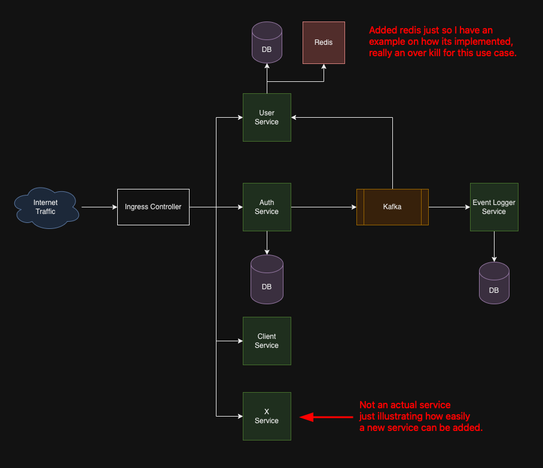

# microservice-examples (Work in progress)

I am planning on creating a nodejs project that will be a good starting point for creating a microservice application. This will be a good Template for creating a microservice application.

# Currently working on

I am trying to get an api gateway working with the microservices. I am using the kong api gateway. I have the kong api gateway running in a docker container. I am trying to get the kong api gateway to route traffic to the services. I am having some issues with the kong api gateway. I will update this when I get it working.

# Microservice Architecture Diagram



# Pre-requisites

- Docker
- Kubernetes (comes with Docker Desktop)
- Skaffold (`brew install skaffold`)
  - Skaffold is a tool that facilitates continuous development for Kubernetes applications. You can iterate on your application source code locally then deploy to local or remote Kubernetes clusters.
- helm (`brew install helm`)
- ingress-nginx [Install instructions](https://kubernetes.github.io/ingress-nginx/deploy/#quick-start)

# How to run locally

1. Clone the repository
   - Create secrets for the service:
     - `kubectl create secret generic jwt-secret --from-literal=JWT_KEY=asdasd`
   - Install the kafka operator
     - `helm repo add strimzi https://strimzi.io/charts/`
     - `helm install my-kafka-operator strimzi/strimzi-kafka-operator`
2. Edit hosts file to add the domain name
   - `sudo nano /etc/hosts`
   - Add the following line: `127.0.0.1 example-app.com`
3. Run the commands: (I seperated kafka from the skaffold file because it was causing issues with the skaffold file, I will fix this later)

- Install kafka cluster: `kubectl apply -f infra/kafka/kafka-deployment.yaml`
- Start develop environment: `skaffold dev`

4. Ensure your browser does NOT have the dns cached version of `example-app.com` by restarting the browser or clearing the cache or open in incognito mode ;)
5. Visit `http://example-app.com/` in your browser you should see the UI for the application.

## Troubleshooting

### Make sure strimzi operator is running before running the kafka deployment

```
k get pods
NAME                                       READY   STATUS    RESTARTS      AGE
strimzi-cluster-operator-97fd6b494-76kxf   1/1     Running   6 (20m ago)   2d

# Run the kafka deployment
k apply -f infra/kafka/kafka-deployment.yaml
kafka.kafka.strimzi.io/systems-kafka-cluster created
configmap/kafka-metrics created
kafkauser.kafka.strimzi.io/my-kafka-user created
secret/my-kafka-user-secret created
```

### Now you should see the kafka pods running

Here is an example of the pods running it takes about 2-3 minutes for the pods to get into the running and stable state.

```
k get pods
NAME                                                     READY   STATUS    RESTARTS      AGE
strimzi-cluster-operator-97fd6b494-76kxf                 1/1     Running   6 (23m ago)   2d
systems-kafka-cluster-entity-operator-7b65f6979b-lqrmm   2/2     Running   0             31s
systems-kafka-cluster-kafka-0                            1/1     Running   2 (65s ago)   72s
systems-kafka-cluster-kafka-1                            1/1     Running   2 (65s ago)   72s
systems-kafka-cluster-kafka-2                            1/1     Running   2 (65s ago)   72s
systems-kafka-cluster-zookeeper-0                        1/1     Running   0             2m9s
systems-kafka-cluster-zookeeper-1                        1/1     Running   0             2m9s
systems-kafka-cluster-zookeeper-2                        1/1     Running   0             2m9s
```

### Now you can run the skaffold dev command

I ommited the output because it is quite long but you should see the services starting up and connecting to kafka and mongoDB

```
skaffold dev
[...]
Watching for changes...
[user]
[user] > user@1.0.0 start
[auth]
[user] > ts-node-dev --poll src/index.ts
[auth] > auth@1.0.0 start
[auth] > ts-node-dev --poll src/index.ts
[auth]
[user]
[auth] [INFO] 11:32:59 ts-node-dev ver. 2.0.0 (using ts-node ver. 10.9.2, typescript ver. 5.5.3)
[user] [INFO] 11:32:59 ts-node-dev ver. 2.0.0 (using ts-node ver. 10.9.2, typescript ver. 5.5.3)
[user] Starting up...
[user] (node:25) [DEP0040] DeprecationWarning: The `punycode` module is deprecated. Please use a userland alternative instead.
[user] (Use `node --trace-deprecation ...` to show where the warning was created)
[user] Connected to mongoDB
[user] listening on port 3000 user service is running...
[auth] Starting up...
[auth] (node:24) [DEP0040] DeprecationWarning: The `punycode` module is deprecated. Please use a userland alternative instead.
[auth] (Use `node --trace-deprecation ...` to show where the warning was created)
[auth] Connected to Kafka
[auth] {"level":"WARN","timestamp":"2024-07-16T11:33:02.278Z","logger":"kafkajs","message":"KafkaJS v2.0.0 switched default partitioner. To retain the same partitioning behavior as in previous versions, create the producer with the option \"createPartitioner: Partitioners.LegacyPartitioner\". See the migration guide at https://kafka.js.org/docs/migration-guide-v2.0.0#producer-new-default-partitioner for details. Silence this warning by setting the environment variable \"KAFKAJS_NO_PARTITIONER_WARNING=1\""}
[auth] Connecting to Kafka producer...
[auth] Connected to Kafka producer
[auth] Consumer found
[auth] Producer found
[auth] {"level":"INFO","timestamp":"2024-07-16T11:33:02.298Z","logger":"kafkajs","message":"[Consumer] Starting","groupId":"system-events-group"}
[auth] {"level":"INFO","timestamp":"2024-07-16T11:33:05.436Z","logger":"kafkajs","message":"[ConsumerGroup] Consumer has joined the group","groupId":"system-events-group","memberId":"auth-a6809e31-339e-49f0-9b08-bd6190ce2414","leaderId":"auth-a6809e31-339e-49f0-9b08-bd6190ce2414","isLeader":true,"memberAssignment":{"system-events":[0]},"groupProtocol":"RoundRobinAssigner","duration":3137}
[auth] Kafka consumer connected
[auth] Connected to MongoDB
[auth] Listening on port 3000
```

# Run tests

- Each service has its own tests that can be run by running `npm run test` in the service directory

# System Design

- I want both async and sync communication between services
  - I want to use a message broker for async communication (Kafka, RabbitMQ, etc.) <-- Kafka
  - I want to use REST for sync communication
- I want to use a database for storing data (Postgres, mongoDB)
- I want to use a caching layer (Redis)
- I want to use a service discovery tool (Consul, etcd) <-- Maybe not needed
- I will use Ingress Controller for routing traffic to services
- Testing will be done using Jest
- I will use Docker for containerization
- I will use Kubernetes for orchestration

## This is later down the road

- I will use Prometheus for monitoring
- I will use Grafana for visualization

# A lot of the stuff learned from this project will be from the following sources:

One course that I learned a lot from is stephen grider's microservices course on udemy. I will be using a lot of the concepts learned from that course in this project. I highly recommend anyone starting with microservices to take this course. I am not affiliated with Stephen Grider in any way. I just think he is a great teacher and this course is worth mentioning. [Stephen Grider's Microservices course](https://www.udemy.com/course/microservices-with-node-js-and-react/).

# Blog posts

I will be writing blog posts about the things I learned while creating this project. I will be posting them on my [blog](https://www.travisallister.com/blog)

- [Using Skaffold for local development](https://www.travisallister.com/post/using-skaffold-for-development-in-kubernetes)
- [Integrating Kafka into Your Kubernetes Microservice Application](https://www.travisallister.com/post/integrating-kafka-into-your-kubernetes-microservice-application)
